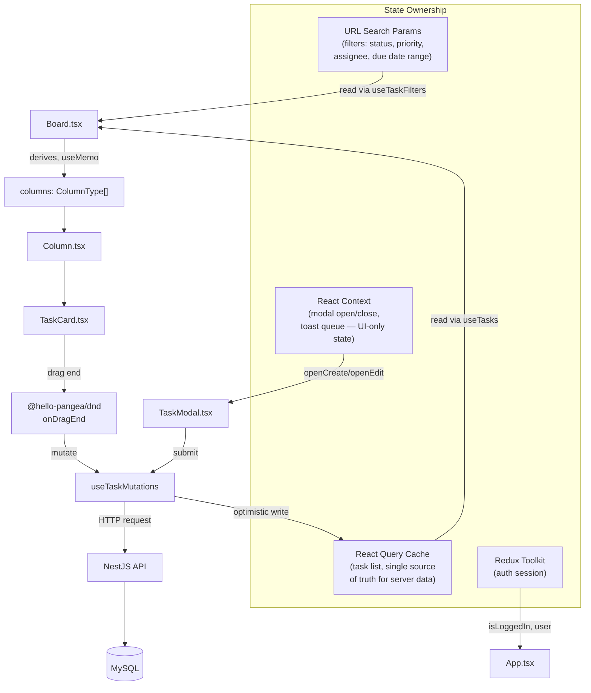
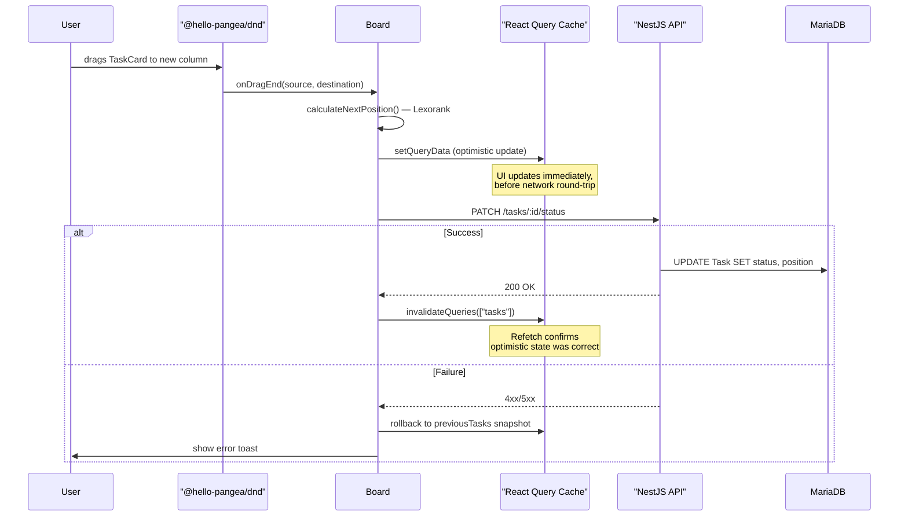

# MiniJira

A Kanban-style task board, built as a learning project to practice production-grade frontend/backend patterns: drag-and-drop, optimistic updates, URL-driven filters, and clean state architecture.


---

## Tech Stack

| Layer        | Technology                 |
| ------------ | -------------------------- |
| Frontend     | React 19, TypeScript, Vite |
| Server state | `@tanstack/react-query`    |
| Drag & drop  | `@hello-pangea/dnd`        |
| Forms        | `react-hook-form`          |
| Backend      | NestJS, Prisma ORM         |
| Database     | MySQL                      |
| Auth state   | Redux Toolkit              |

---

## Architecture Overview

The app is split into three independent state domains, each owned by a different mechanism — this is the single most important architectural decision in the codebase, and it eliminates an entire class of bugs (race conditions between competing sources of truth) that earlier iterations of this project ran into.



**Why three separate mechanisms instead of one global store:**

- **URL** owns filter state because it must be shareable (copy link → paste in new tab → same filtered view) and must survive a page refresh. Redux/Context state both vanish on refresh; the URL doesn't.
- **React Query cache** owns all task data. There is no local `useState` copy of the task list anywhere — `columns` (the Kanban grouping) is _derived_ from the cache via `useMemo`, never stored separately. Earlier versions of this board kept a parallel `useState` for `columns` that was manually synced from the cache; this created a race condition where drag-and-drop's optimistic update and the cache's "real" data could disagree about which column a task was in, depending on network timing.
- **Context** owns only ephemeral UI state that has no business being persisted or shared via URL — modal visibility and toast queue. Context values are wrapped in `useMemo` to prevent unrelated consumers from re-rendering on every parent render.

---

## Data Flow: Drag and Drop

This is the most complex interaction in the app, so it's worth diagramming on its own.



**Key implementation detail:** the optimistic update and the rollback snapshot are both owned by the _mutation's_ `onMutate`/`onError` lifecycle (inside `useTaskMutations`), not by the component calling it. `Board.tsx` does not call `queryClient.setQueryData` directly anymore — an earlier version did, and it caused the rollback snapshot to capture an already-mutated state, making error recovery silently no-op. Centralizing this in one place (`buildOptimisticMutationOptions`) means every mutation — update, status change, delete — gets correct optimistic behavior for free.

---

## Project Structure

```
src/
├── components/
│   ├── Board/              # Top-level Kanban view, owns DragDropContext
│   ├── Column/              # Renders one status column, Droppable target
│   ├── TaskCard/             # Single task card, Draggable item
│   ├── TaskModal/            # Create/edit form, react-hook-form + FormProvider
│   ├── BoardToolBar/         # Filter controls, reads/writes URL params
│   ├── Toast/                # Toast rendering, reads from ToastContext
│   └── ErrorBoundary/        # Top-level render-error fallback
├── context/
│   ├── ModalContext.tsx      # Modal open/close + which task is being edited
│   └── ToastContext.tsx      # Toast queue
├── hooks/
│   ├── task.hook.ts          # useTasks, useTaskMutations (React Query)
│   └── useTaskFilters.ts     # Reads/writes filter state to/from URL
├── helpers/
│   └── task.helper.ts        # mapTasksToColumns, Lexorank position calc
└── types/
    └── task.type.ts
```

---

## Key Design Decisions & Trade-offs

### Filters live in the URL, not in global state

Required by the spec ("copy URL with filters, paste new tab — same view"). `useTaskFilters()` wraps `useSearchParams`, exposing a clean `{ params, setParams }` API so components never touch the URL directly.

### Search is debounced before it touches the URL

Debouncing happens at the point of writing to the URL, not at the point of firing the API request — typing into the search box updates local component state immediately for responsive UI, then writes to `searchParams` (and triggers a refetch) only after the user pauses.

### Column scrolling: page-level, not per-column

`@hello-pangea/dnd` does not support a `Droppable` nested inside two independent scroll containers (a known limitation — [tracked here](https://github.com/atlassian/react-beautiful-dnd/issues/131)). Rather than fight the library with a hand-rolled horizontal-scroll implementation, columns grow to their natural height and the whole board scrolls vertically together. The trade-off: a column with many tasks is no longer independently scrollable with a sticky header — acceptable for a 4-column fixed board, and far lower-risk than maintaining custom scroll math.

### `React.memo` is applied selectively, not everywhere

Memoization was added only where React DevTools Profiler showed a component re-rendering for a reason unrelated to its own props or state (e.g. `BoardToolBar` re-rendering purely because its parent, `Board`, re-rendered on every drag). Components that legitimately re-render because their displayed data changed (e.g. `TaskCard` for the task that just moved) are left unmemoized — wrapping every component in `memo` regardless of measured impact was deliberately avoided.

### Toasts are not shown for every successful drag

`updateTaskStatus` intentionally skips a success toast — dragging tasks is a frequent, low-stakes action, and a toast firing on every drop would be noise rather than signal. Errors still surface a toast, since that's the one case the user needs to act on.

---

## Getting Started

```bash
# Frontend
cd frontend
npm install
npm run dev

# Backend
cd backend
npm install
npx prisma migrate dev
npm run start:dev
```

Environment variables required (see `.env.example` in each package):

- `DATABASE_URL` (backend)
- `VITE_API_BASE_URL` (frontend)

---

## Known Limitations

- Create operations are not optimistic (no temp-ID reconciliation) — acceptable since task creation isn't a high-frequency interaction.
- No automated test suite yet.
- Drag-and-drop touch support on mobile has not been extensively tested across devices.
